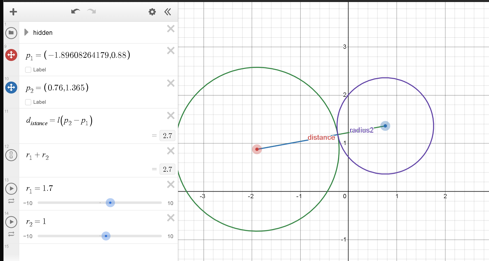

## Session 1

Let's try improving our code from last time
```py
# No tutorial sheets are referenced for this 
import pygame

clock = pygame.time.Clock()

window_dimensions = (500, 500)
fps = 60 # frames per second
dt = 1/fps # duration of each frame

window = pygame.display.set_mode(window_dimensions)

# constants
gravity = 50 # pixels per s^2
restitution = 0.99 # how much velocity is conserved on collision

# initializing ball's position and velocity
position = pygame.Vector2(0,250)
velocity = pygame.Vector2(100,0)
radius = 10

# updating physics per frame
def update():
    # this ensures our function can write
    # to position and velocity
    global position, velocity

    # euler integration
    position += velocity * dt
    velocity.y += gravity * dt

    # collision detection
    if position.x < radius:
        velocity.x *= -restitution
        position.x = radius
    elif position.x > window_dimensions[0]-radius:
        velocity.x *= -restitution
        position.x = window_dimensions[0]-radius 
    
    # collision detectiongit
    if position.y < radius:
        velocity.y *= -restitution
        position.y = radius
    elif position.y > window_dimensions[1]-radius:
        velocity.y *= -restitution
        position.y = window_dimensions[1]-radius 
    

running = True
while running:
    window.fill((20,20,20))

    for event in pygame.event.get():
        if event.type == pygame.QUIT:
            running = False
        if event.type == pygame.KEYDOWN:
            if event.key == pygame.K_ESCAPE:
                running = False 

    # updating the physics before drawing
    # the next frame:
    update()

    pygame.draw.circle(window, (200,0,0), position, radius)

    pygame.display.update()
    
    clock.tick(fps)
```

Let's adress the main issue : every time we want to create a new particle, we need to create a new position variable, a new velocity variable, a new radius variable. Right now we're working with very few simple shapes. What if we had 100s of particles to manage. Our current way of working is very inefficent.
Instead, we're going to create a class.

## Classes
Classes in python art a sort of containers, like a data structure. Instead of seperating our particle's properties into different variables, we can put it all into one class.

**BEFORE**
```py
...
particle1_position = pygame.Vector2(250,250)
particle1_velocity = pygame.Vector(0,0)
particle1_radius = 10

particle2_position = pygame.Vector2(50,250)
particle2_velocity = pygame.Vector(50,0)
particle2_radius = 5

while True:
    ...
    particle1_position += particle1_velocity * dt
    particle2_position += particle2_velocity * dt 

    pygame.draw.circle(..., particle1_position particle1_radius)

    pygame.draw.circle(...,particle2_position, particle2_radius)
    ...
```
**AFTER**
```py
...
class Particle:
    # this function is what sort of creates the particle
    def __init__(self, position, initial_velocity=pygame.Vector2(0,0),radius=5):
        # self is needed as the first argument in every single class function (we call these functions methods).
        self.position = position
        self.velocity = initial_velocity
        self.radius = radius
        self.color = (255,255,255) # color particles white
    
    # Now we can create a function that updates any given particle
    def update(self):
        self.velocity.y += GRAVITY * dt
        self.position += self.velocity * dt

        # Write collision with walls here
        # ... 
        # ...

    
    def draw(self,surface):
        pygame.draw.circle(surface, self.color, self.position, self.radius)

...

particles = [Particle(pygame.Vector2(0,0)), 
Particle(pygame.Vector2(100,100), pygame.Vector2(100,0), 5)]

while True:
    ...
    for particle in particles:
        particle.update()

    for particle in particle:
        particle.draw(window)
    
    ...
```

Although our code is now much longer, it's also more organized! And, no matter how many different particles we want, the size of our main loop won't change! Refer to the newcode in abstracted02.py

## Collision detection
If we run abstracted02.py, you'll see that although we have multiple balls, they don't actually collide. The first step to collision physics, is actually detecting when there is a collision

We can check for a collision for each pair of particles as such in our opdate function:

```py
def update():
    ...
    # do physics updates
    ...
    for i in range(len(particles)):
        for j in range(i+1,len(particles)):
            if colliding(particles[i], particles[j]):
                respondCollision(particles[i], particles[j])
```
Now, lets program our `colliding(p1,p2)` function.

If two particles are perfectly touching, the distance between their two centers is the sum of their radii:

Thus if two circles are perfectly colliding $|p_2 - p_1| = r_1 + r_2$.

Then, if their distance is less than or equal to $r_1+r_2$, we say that they are colliding.

Or equivalently if $|p_2-p_1|^2 \leq (r_1+r_2)^2$ since we like to avoid computing lengths of vectors due to the performance costs of square rooting.

Lets code our colliding(p1,p2) function : 
```py
def colliding(particle1, particle2):
    # compute distance
    d = (particle2.position - particle1.position).length_squared()

    # return if they are colliding
    return d <= (particle1.radius + particle2.radius)**2
```

## Collision Response Math
This section is gonna be much more mathematical and if you'd like to skip the derivative, you could simply use the formula we derive here. 

There are two laws that govern our collision, conservation of the momentum vector and conservation of kinetic energy.
> $\vec{P} = m_1\vec{v_1} +m_2\vec{v_2} = \text{const}$
    $E_k = \frac{1}{2}( m_1|v_1|^2 + m_2|v_2|^2 ) = \text{const}$

Trying to solve these equations normally is incrdibly tedious and complicated. Instead we can use a neat trick!

When the two balls collide, the normal force they apply on each other is on the same line as their centers. Thus, we can say $\vec{n} \parallel \vec{p_2} - \vec{p_1}$. We can normalize this vector to a length of 1 by dividing it by it's length. $\hat{n} = \frac{\vec{n}}{|p_2 - p_1|}$. This vector $\hat{n}$ is the normal direction. Since the two particles apply forces on each other ONLY along this direction, then their velocities will only change along this direction.

For each velocity, let the velocity after the collision be the same with some offset along the normal direction (positive or negative) : >
> $\vec{v_1}' = \vec{v_1} + \alpha \hat{n}$
$\vec{v_2}' = \vec{v_2} + \beta \hat{n}$

Now lets plug this into our equation for conservation of momentum. The reader can try solving the rest as an excercice.
> $m_1\vec{v_1} + m_2\vec{v_2}=m_1\vec{v_1}' + m_2\vec{v_2}'$
> $m_1\vec{v_1} + m_2\vec{v_2}=m_1(\vec{v_1} + \alpha \hat{n})+ m_2(\vec{v_2} + \beta \hat{n})$
> $m_1\vec{v_1} + m_2\vec{v_2}=m_1\vec{v_1} + m_1\alpha \hat{n}+ m_2\vec{v_2} + m_2\beta \hat{n}$
> $\vec{0}=m_1\alpha \hat{n}+ m_2\beta \hat{n}$
> $\vec{0}=(m_1\alpha+ m_2\beta) \hat{n}$
Thus, since $\hat{n}$ itself is not 0,
> $m_1\alpha + m_2\beta = 0 \rightarrow \beta = -\frac{m1}{m2}\alpha$

Now, lets sub back into our equation for conversation of kinetic energy.

> $m_1|v_1|^2 + m_2|v_2|^2 = m_1|v_1'|^2 + m_2|v_2'|^2$
> $m_1|v_1|^2 + m_2|v_2|^2 = m_1|v_1 + \alpha \hat{n}|^2 + m_2|v_2 + \beta \hat{n}|^2$

The length squared of a sum of two vector $\vec{m}$ and $\vec{n} $ is 
> $|\vec{m} + \vec{n}|^2 = |m|^2 + |n|^2 + 2(\vec{m} \cdot \vec{n})$

Try proving it! Thus,
> $m_1|v_1|^2 + m_2|v_2|^2 = m_1|v_1 + \alpha \hat{n}|^2 + m_2|v_2 + \beta \hat{n}|^2$
> $m_1|v_1|^2 + m_2|v_2|^2 = m_1|v_1|^2 + m_1|\alpha \hat{n}|^2 + 2m_1(\vec{v_1} \cdot \alpha\hat{n}) +m_2|v_2|^2 + m_2|\beta \hat{n}|^2 + 2m_2(\vec{v_2} \cdot \beta\hat{n}) $
Recall that $|\hat{n}| = 1 $, thus $|\alpha \hat{n}| = \alpha$ and $|\beta \hat{n}| = \beta$
> $0=  m_1\alpha^2 + 2m_1\alpha(\vec{v_1} \cdot \hat{n}) + m_2\beta^2 + 2m_2\beta(\vec{v_2} \cdot \hat{n}) $
Substitute $\beta = -\frac{m_1}{m_2}\alpha$
$0 = m_1\alpha^2 + m_2\left(\frac{-m_1}{m_2}\alpha\right)^2 + 2m_1\alpha(\vec{v_1} \cdot \hat{n}) + 2m_2\left(\frac{-m_1}{m_2}\alpha\right)(\vec{v_2} \cdot \hat{n})$
Simplify each term:
$0 = m_1\alpha^2 + m_2 \cdot \frac{m_1^2}{m_2^2}\alpha^2 + 2m_1\alpha(\vec{v_1} \cdot \hat{n}) - 2m_1\alpha(\vec{v_2} \cdot \hat{n})$
> $0 = (m_1 + \frac{m_1^2}{m_2})\alpha^2 + 2m_1(\vec{v_1} \cdot \hat{n} - \vec{v_2} \cdot \hat{n})\alpha$
Factor out $\alpha$ since it is non-zero (there has to be a change in velocity).
$-2m_1((\vec{v_1} - \vec{v_2}) \cdot \hat{n})  = m_1(\frac{m_1+m_2}{m_2})\alpha$
$\alpha = \frac{2m_2}{m_1+m_2}[(\vec{v_2} - \vec{v_1})\cdot \hat{n}]$

We're done! We have solved for alpha. Here are our final equations.

> compute $\hat{n} = \frac{\vec{p_2-\vec{p_1}}}{|\vec{p_2} - \vec{p_1}|}$
> compute $\alpha = \frac{2m_2}{m_1+m_2}[(\vec{v_2} - \vec{v_1})\cdot \hat{n}]$
> compute $\beta = \frac{-m_1}{m_2}\alpha$
> update $\vec{v_1}' = \vec{v_1} + \alpha \hat{n}$
> update $\vec{v_2}' = \vec{v_2} + \beta \hat{n}$

In the next section we will simply implement this.

## Collision Response
Lets create our function which updates the velocities of our particles after collision.

```py
```